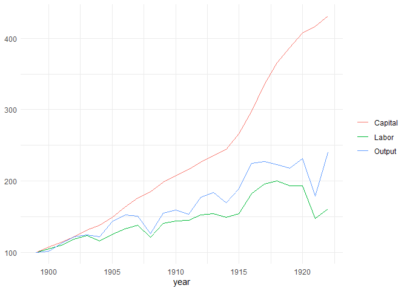
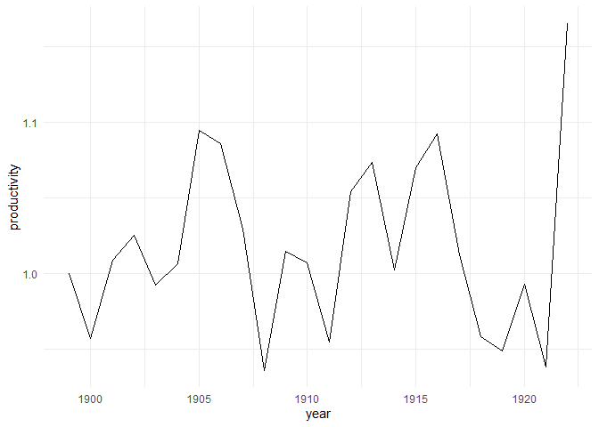
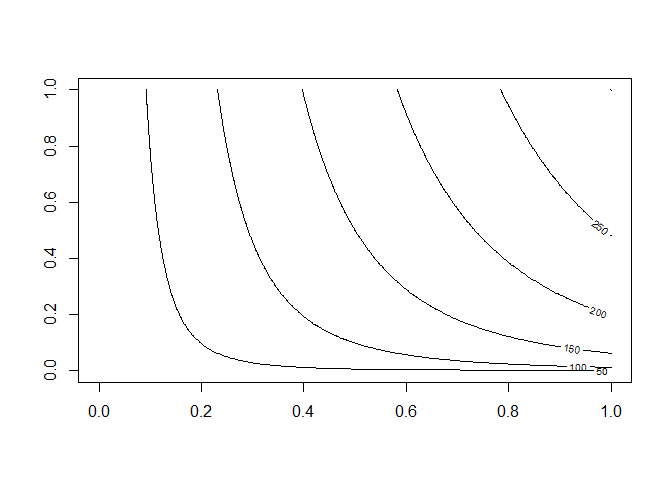

Cobb-Douglas
================
Hans Elliott

2023-02-13

``` r
# Original Dataset from Cobb-Doublas 1928
# https://web.holycross.edu/RePEc/eej/Archive/Volume31/V31N3P427_445.pdf
table = "Year Output Labor Capital
1899 100 100 100
1900 101 105 107
1901 112 110 114
1902 122 118 122
1903 124 123 131
1904 122 116 138
1905 143 125 149
1906 152 133 163
1907 151 138 176
1908 126 121 185
1909 155 140 198
1910 159 144 208
1911 153 145 216
1912 177 152 226
1913 184 154 236
1914 169 149 244
1915 189 154 266
1916 225 182 298
1917 227 196 335
1918 223 200 366
1919 218 193 387
1920 231 193 407
1921 179 147 417
1922 240 161 431
"
# parse the table into dataframe format
table = strsplit(table, split="\n")[[1]]
data_1928 = NULL
for (line in table) {
  row = strsplit(line, split=" ")[[1]]
  if (row[1] == "Year") next
  year = as.integer(row[1])
  output = as.numeric(row[2])
  labor = as.numeric(row[3])
  capital = as.numeric(row[4])
  data_1928 = rbind(data_1928, data.frame(year,output,labor,capital))
}
```

``` r
cobb_douglas = function(L, K, A=1.01, alpha=0.75) {
  # P(L, K) = A * L^(alpha) * K^(1-alpha)
  # L : labor
  # K : capital
  # A : total factor productivity
  # alpha : output elasticity of labor
  # 1-alpha: output elasticity of capital
  return( A * L**alpha * K**(1-alpha) )
}
```

## Implied Total Factor Productivity

``` r
factor_productivity = function(P, L, K, alpha=0.75) {
  # A = P / [L^(alpha) * K^(1-alpha)]
  return(
    P / (L**alpha *  K**(1-alpha))
  )  
}

data_1928["productivity"] = mapply(factor_productivity, 
                                   data_1928$output, 
                                   data_1928$labor,
                                   data_1928$capital)
data_1928
```

       year output labor capital productivity
    1  1899    100   100     100    1.0000000
    2  1900    101   105     107    0.9573780
    3  1901    112   110     114    1.0091304
    4  1902    122   118     122    1.0253175
    5  1903    124   123     131    0.9923732
    6  1904    122   116     138    1.0070396
    7  1905    143   125     149    1.0948559
    8  1906    152   133     163    1.0861954
    9  1907    151   138     176    1.0296496
    10 1908    126   121     185    0.9364586
    11 1909    155   140     198    1.0152415
    12 1910    159   144     208    1.0071854
    13 1911    153   145     216    0.9551069
    14 1912    177   152     226    1.0545410
    15 1913    184   154     236    1.0738640
    16 1914    169   149     244    1.0026504
    17 1915    189   154     266    1.0705350
    18 1916    225   182     298    1.0928861
    19 1917    227   196     335    1.0129141
    20 1918    223   200     366    0.9586545
    21 1919    218   193     387    0.9492066
    22 1920    231   193     407    0.9932199
    23 1921    179   147     417    0.9382769
    24 1922    240   161     431    1.1653933

``` r
ggplot(data_1928, aes(x=year)) +
  geom_line(aes(y=labor, color="Labor")) +
  geom_line(aes(y=capital, color="Capital")) +
  geom_line(aes(y=output, color="Output")) +
  theme_minimal() +
  labs(y=NULL, color=NULL)
```



``` r
ggplot(data_1928) +
  geom_line(aes(x=year, y = productivity)) +
  theme_minimal()
```



## Re-Estimating Alpha

``` r
# Originally, Cobb and Douglas did not account for technical progress
# ln(Q_t) = c + alpha * ln(L_t) + beta * ln(K_t)
m1 = lm(log(output) ~ log(labor) + log(capital), data=data_1928)
summary(m1)
```


    Call:
    lm(formula = log(output) ~ log(labor) + log(capital), data = data_1928)

    Residuals:
          Min        1Q    Median        3Q       Max 
    -0.075282 -0.035234 -0.006439  0.038782  0.142114 

    Coefficients:
                 Estimate Std. Error t value Pr(>|t|)    
    (Intercept)  -0.17731    0.43429  -0.408  0.68721    
    log(labor)    0.80728    0.14508   5.565  1.6e-05 ***
    log(capital)  0.23305    0.06353   3.668  0.00143 ** 
    ---
    Signif. codes:  0 '***' 0.001 '**' 0.01 '*' 0.05 '.' 0.1 ' ' 1

    Residual standard error: 0.05814 on 21 degrees of freedom
    Multiple R-squared:  0.9574,    Adjusted R-squared:  0.9534 
    F-statistic: 236.1 on 2 and 21 DF,  p-value: 4.038e-15

``` r
# Their original estimate of alpha ~= 0.751 came from estimating in "per-capita" terms,
# ie, quantity and capital are expressed in terms of workers:
# ln(Q_t / L_t) = (alpha + beta - 1)*ln(L_t) + beta * ln(K_t/L_t)
m2 = lm(log(output/labor) ~ log(labor) + log(capital/labor), data=data_1928)
summary(m2)
```


    Call:
    lm(formula = log(output/labor) ~ log(labor) + log(capital/labor), 
        data = data_1928)

    Residuals:
          Min        1Q    Median        3Q       Max 
    -0.075282 -0.035234 -0.006439  0.038782  0.142114 

    Coefficients:
                       Estimate Std. Error t value Pr(>|t|)   
    (Intercept)        -0.17731    0.43429  -0.408  0.68721   
    log(labor)          0.04033    0.09120   0.442  0.66283   
    log(capital/labor)  0.23305    0.06353   3.668  0.00143 **
    ---
    Signif. codes:  0 '***' 0.001 '**' 0.01 '*' 0.05 '.' 0.1 ' ' 1

    Residual standard error: 0.05814 on 21 degrees of freedom
    Multiple R-squared:  0.6367,    Adjusted R-squared:  0.6021 
    F-statistic: 18.41 on 2 and 21 DF,  p-value: 2.411e-05

``` r
print(paste("1 - alpha - beta =", coef(m2)["log(labor)"]))
```

    [1] "1 - alpha - beta = 0.0403316972010126"

``` r
print(paste("alpha = 1 - beta - 0.04 =", 
            1 - coef(m2)["log(capital/labor)"] - coef(m2)["log(labor)"] 
))
```

    [1] "alpha = 1 - beta - 0.04 = 0.72661482710977"

``` r
# Facing criticism, it was re-estimated with an expoential time-trend
# ln(Q_t) = c + lambda * T + alpha * ln(L_t) + beta * ln(K_t)
m3 = lm(log(output) ~ year**2 + log(labor) + log(capital), data=data_1928)
summary(m3)
```


    Call:
    lm(formula = log(output) ~ year^2 + log(labor) + log(capital), 
        data = data_1928)

    Residuals:
         Min       1Q   Median       3Q      Max 
    -0.07490 -0.03998 -0.00213  0.01210  0.12985 

    Coefficients:
                  Estimate Std. Error t value Pr(>|t|)    
    (Intercept)  -86.19502   38.09165  -2.263   0.0349 *  
    year           0.04690    0.02077   2.258   0.0353 *  
    log(labor)     0.90601    0.13972   6.485 2.54e-06 ***
    log(capital)  -0.52615    0.34117  -1.542   0.1387    
    ---
    Signif. codes:  0 '***' 0.001 '**' 0.01 '*' 0.05 '.' 0.1 ' ' 1

    Residual standard error: 0.05318 on 20 degrees of freedom
    Multiple R-squared:  0.9661,    Adjusted R-squared:  0.961 
    F-statistic: 189.8 on 3 and 20 DF,  p-value: 7.355e-15

## Plotting the Cobb-Douglas Function

``` r
n_dim = 300
P = outer(0:n_dim, 0:n_dim, FUN = cobb_douglas, A = 1, alpha = 0.75)

# Looks like y = Labor, x = Capital
plotly::plot_ly(z=~P) |> 
  plotly::add_surface() |> 
    layout(title = 'Cobb-Douglas Production Function', 
           plot_bgcolor = "#e5ecf6")
```


``` r
# Isoquants
contour(P)
```


