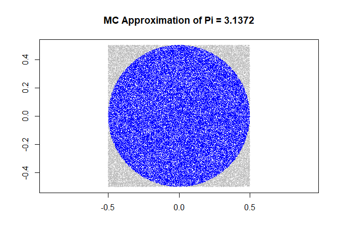
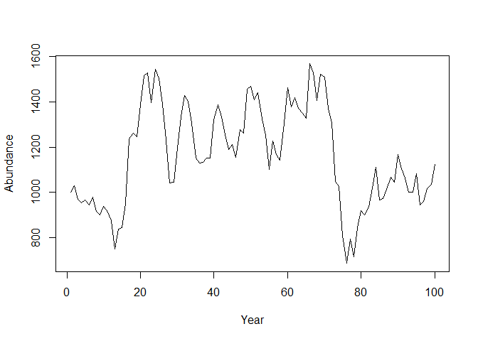
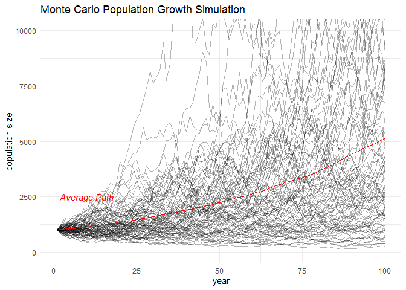

Monte Carlo Simulations in R
================
Hans Elliott
5/2/2022

``` r
library(ggplot2)
```

# Approximating Pi

**inspiration:
<https://www.countbayesie.com/blog/2015/3/3/6-amazing-trick-with-monte-carlo-simulations>**

-   The area of a circle = pi\*r^2.  
-   The area of a square containing that circle would be 4\*r^2.  
-   Thus, pi = the ratio of area of circle / area of the square, times
    4.  
-   We know a point falls within the circle if x^2 + y^2 is less than or
    equal to the radius. By repeatedly sampling from numbers within the
    range of the rectangle that encompasses the circle, we can
    approximate the area of the circle and the area of the rectangle,
    and then solve for Pi.

``` r
runs = 100000L
radius = 0.5

x = runif(runs, min = -radius, max = radius)
y = runif(runs, min = -radius, max = radius)

in_circle = (x^2 + y^2) <= radius^2 ##returns TRUE if inequality is true

monte_carlo_pi = sum(in_circle/runs) * 4


plot(x,y,
     pch='.',col=ifelse(in_circle,"blue","grey"),
     xlab='',ylab='',asp=1,
     main=paste("MC Approximation of Pi =",monte_carlo_pi))
```

<!-- -->

# Something more fun: Population growth

**source: <https://bstaton1.github.io/au-r-workshop/ch4.html>**

``` r
## Create function that simulates population growth over time
pop_sim = function(nt = "number of years",
                   grow = "population growth rate",
                   sd_grow = "annual variation in growth rate",
                   u = "annual exploitation rate",
                   initial_size = "initial population size")
{
  pop_size = NULL
  pop_size[1] = initial_size
  
  for (t in 2:nt){
    pop_size[t] = (pop_size[t-1]* grow * rlnorm(1, 0, sd_grow)) * (1 - u)
  }
  
  return(pop_size)
} #end pop_sim fn
```

``` r
#Example:
sim_1 = pop_sim(nt = 100,
                grow = 1.1,
                sd_grow = 0.1,
                u = 0.08,
                initial_size = 1000)
plot(sim_1, type = "l", pch = 15, xlab = "Year", ylab = "Abundance")
```

<!-- -->

``` r
##replicate 1000 times
sim_multiple = replicate(n = 1000, expr =  pop_sim(nt = 100,
                                                   grow = 1.1,
                                                   sd_grow = 0.1,
                                                   u = 0.08,
                                                   initial_size = 1000))


sim_multiple = as.data.frame(sim_multiple) ##convert to dataframe before ggplot
sim_multiple$index = 1:nrow(sim_multiple)  ##add row numbers = years
  


library(ggplot2)
p = ggplot(data = sim_multiple)
for (i in 1:100){ ##iteratively add geom_lines from each simulation run
  p = p + geom_line(mapping = aes_string(x = "index", y = sim_multiple[,i]), 
                 alpha = 0.3)
}

#Display plot
p + labs(title = "Monte Carlo Population Growth Simulation",
         x = "year", y = "population size") +
    coord_cartesian(ylim = c(0, 10000)) +
    theme_minimal() +
    ##plot mean path 
    geom_line(aes(x = index, y = rowMeans(sim_multiple[,-index])),##rows=years
              color = "red") + 
    annotate("text", x = 10, y = 2500, label = "Average Path",
             color = 'red', fontface = 3)
```

<!-- -->
